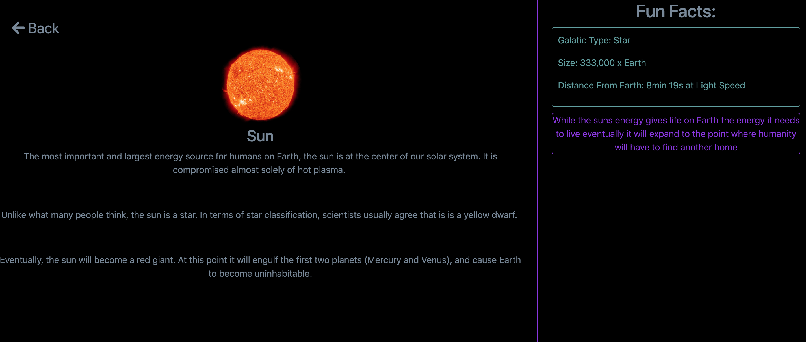

# cosmicjs-space-scholastic
Find out how I built this project (): 
> Scholastic site about Space built using CosmicJS


## Build Setup

``` bash
# install dependencies
npm install

# serve with hot reload at localhost:8080
npm run dev

# build for production with minification
npm run build
```

For detailed explanation on how things work, consult the [docs for vue-loader](http://vuejs.github.io/vue-loader).
